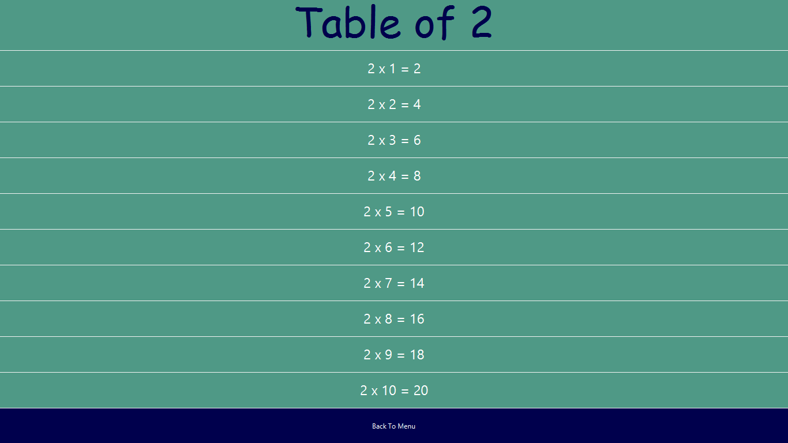

# JavaProject
object-oriented programming
## NAME:
Table Tantrum

## LANGUAGE
    Java
    
## PREREQUISITES
1.  JDK 8 or above
2.  javafx JAR files
````
     javafx.base
     javafx.controls	        
     javafx.graphics 
 ````   
## TO RUN
 The main file(containing the method **main**) of the code is **Gui.java**
 You can either use the java IDE ecclipse, netbean e.t.c to run the code
 
 Also, you can run a Jar from the Command Prompt. Press the Win key + X hotkey and select Command Prompt (Admin) to open it as  administrator.Then input 
```
java -jar c:pathtojarfile.jar
````
in the Command Prompt and press Enter

**Replace c:pathtojarfile.jar with the actual path and file title of the Jar you need to run in Windows.**

Alternatively, you can open the folder that includes the Jar in the Command Prompt. first by entering ‘cd /’ followed by the directory. 
Then, you can input 
````
java -jar file.jar
`````
without the folder path.

That will open the executable Jar file and game will start.

## SYSTEM OUTPUT
Menu Screen
  
  
select Level to Play  
  
  
 Play Screen 
  
  
Revise tables from **2-15**  
  
  
For instance, table of 2 
  
 
 View your 10 recent Scores
  
 
 Pictorial representation of your Performance
  
     
## AUTHORS
 Fatima Seemab
 Maryam Fatima
 
## STATUS
  complete
